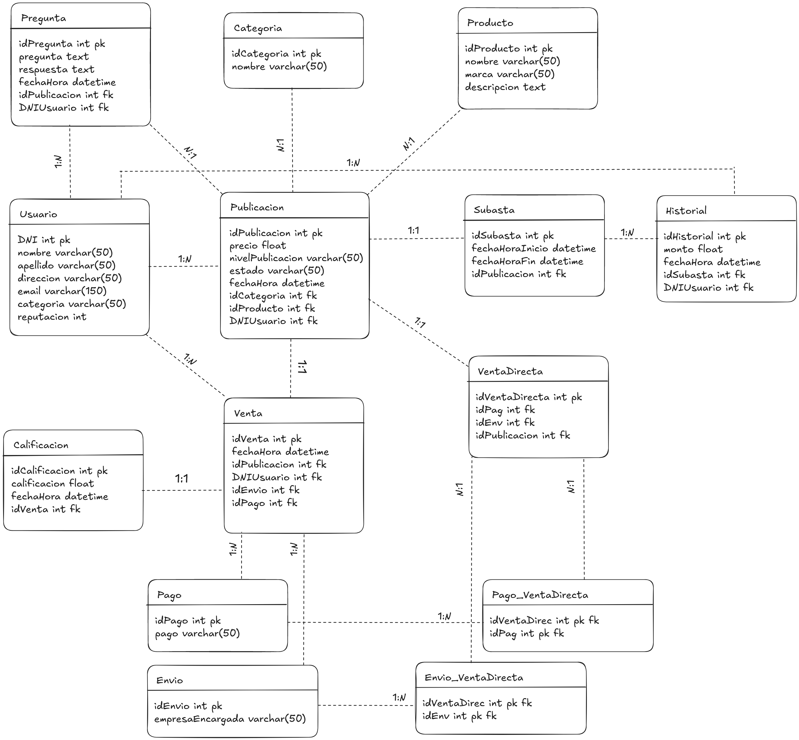

# TP_BDD

Integrantes: Matias Ruiz, Camilo Reartes, Thiago Miranda, Nicolas Orgnero

## Objetivo
Crear una base de datos en MySQL con las tablas que crean necesarias para almacenar los datos de un Sistema de e-commerce.

 

Enunciado
 

Un sistema de e-commerce consiste en la compra y/o venta de productos a través de medios electrónicos. Para ello, los usuarios realizan publicaciones en la plataforma, especificando los detalles del producto y el monto por el cual están dispuestos a venderlo.
Existen diferentes tipos de usuarios, distintos tipos de productos, múltiples categorías y variedades de publicaciones que aumentan la complejidad y la diversidad de este tipo de plataformas.

Deberán pensar en las tablas que sean necesarias para almacenar los datos correspondientes a un sistema como el descrito, almacenando un conjunto de datos en ellas, teniendo en cuenta las funcionalidades de dicho sistema que se detallan a continuación.

Funcionalidad

<u>Usuarios:</u> El sistema debe permitir la creación, la modificación, el listado, la búsqueda y la
eliminación de diferentes tipos de usuarios. Un nuevo usuario registrado en la plataforma no
posee categorización alguna. Sin embargo, dentro de la plataforma existen diferentes tres
niveles de usuarios:

- Normal: De 1 a 5 ventas.
- Platinum: De 6 a 10 ventas o una facturación de $100.000 o más.
- Gold: Aquellos que tengan 11 ventas o más o una facturación de $1.000.000 o mayor.

Además, el usuario cuenta con un sistema de reputación, que evalúa el nivel de sus
transacciones (compras y ventas) dentro del sistema.
Cada vez que se realiza una transacción, tanto el usuario vendedor como el usuario comprador,
recibe una calificación en base a si se concretó la operación y el nivel de satisfacción de la
misma.
La reputación es medida en una escala porcentual de 0 a 100.

<u>Publicaciones:</u> Se deben poder crear nuevas publicaciones, modificar, listar, buscar y
eliminarlas. Cada publicación tiene asociada un producto, una categoría, un precio y un usuario
vendedor. Además cuenta con una sección de preguntas (realizadas por usuarios interesados
en el producto) y respuestas (realizadas solo por el usuario vendedor).
Dentro de las publicaciones hay dos variantes posibles:
- Venta directa.
- Subasta.
La primera acepta medios de pago y de envío del producto. Una vez que un usuario compra el
producto, la publicación se ve finalizada.
La segunda aumenta el monto ofertado por el producto, pero no finaliza la publicación. Existen
diferentes tipos de publicaciones que determinan el nivel de exposición a la hora de ser
listadas. De acuerdo al nivel de la publicación será el orden de visualización en los listados.
- Publicación Bronce.
- Publicación Plata.
- Publicación Oro.
- Publicación Platino.

<u>Productos:</u> Para que un usuario pueda realizar una publicación es necesario que cree un
producto. En el mismo debe especificar un nombre del producto y otorgar una descripción
acorde. Tanto el nombre como la descripción estarán visibles en la publicación. Los productos
creados pueden ser modificados.
Todas los cambios realizados sobre un producto deberán ser visualizados en las publicaciones
que contengan dicho producto. Los productos que ya han sido publicados no pueden ser
eliminados. Para ello, es necesario finalizar primero la publicación y luego eliminar el producto.

<u>Categorías:</u> Los usuarios deben poder crear, modificar, listar y buscar categorías. Solo se podrá
eliminar una categoría si ésta no tiene ninguna publicación activa asociada.
Aclaración: Si se crea una categoría, se publica un producto asociado con esta categoría y la
venta es concretada, la categoría puede ser eliminada.

<u>Preguntas y respuestas:</u> En las publicaciones activas, es decir, aquellas que todavía no se han
concretado, los usuarios interesados podrán efectuar preguntas acerca del producto
publicado. Las mismas solo deben ser respondidas por el usuario vendedor asociado a la
cuenta. Una vez que la publicación ha finalizado, las preguntas y respuestas estarán
inhabilitadas.

<u>Medios de Pagos y Envíos:</u> Se podrá pagar mediante tarjeta de crédito, tarjeta de débito, Pago
Fácil o Rapipago. Los envíos se harán por OCA o Correo Argentino.

Stored Procedures

1. Definir un procedimiento buscarPublicacion que reciba el nombre de un producto y
muestre todas las publicaciones en las cuales está incluido ese producto. Mostrando el
id_publicacion, nombre producto, nombre categoría a la que pertenece y el precio de
publicación.
2. Definir un procedimiento crearPublicacion que reciba los datos de la publicación e
inserte una fila en la tabla publicación. Además tiene que recibir el tipo de publicación,
si es una subasta o una venta directa.
3. Crear un procedimiento llamado verPreguntas que muestre todas las preguntas de una
publicación.
4. Crear un procedimiento actualizarReputacionUsuarios que para cada usuario calcule el
promedio de las calificaciones recibidas en las ventas realizadas (tanto como vendedor
y comprador) y actualice el campo reputación con ese promedio (en escala 0-100).
Usar cursores.

Stored Functions

1. Crear la función comprarProducto que debe recibir un usuario comprador, una
publicación, un medio de pago y un tipo de envío. Tiene que verificar que la publicación
este activa, si no lo esta devuelve un mensaje ‘La publicación no está activa’. Si está
activa verifica que se trate de una compra y no de una subasta. Si es una subasta
devuelve el mensaje ‘Es una subasta’ y sino hace las modificaciones e inserts
correspondientes.
2. Crear la función cerrarPublicacion que debe cambiar el estado de la publicación a
Finalizada. La función tiene que verificar que el usuario recibido por parámetro
coincida con el usuario vendedor cargado en la publicación ya que solo el usuario
vendedor puede cerrar la publicación. También tiene que verificar que no tenga
calificaciones pendientes.
3. Crear la función eliminarProducto que debe eliminar un producto para lo cual verifica
que el producto no esté asociado a ninguna publicación devolviendo el mensaje
correspondiente en cada caso.
4. Crear la función pausarPublicacion que debe verificar la existencia de la publicación
recibida por parámetro y le cambia el estado a Pausada.
5. Crear la función pujarProducto que debe verificar que la publicación esté activa y que
corresponda a una subasta. Si no suceden estas dos cosas devuelve el mensaje
apropiado. Si se cumplen esas dos condiciones actualiza la tabla de subasta con los
parámetros recibidos y devuelve el mensaje ‘pujado satisfactoriamente’.
6. Crear la función eliminarCategoria que debe verificar que no haya ninguna publicación
para esa categoría y la elimina devolviendo el mensaje correspondiente en cada caso.
7. Crear la función puntuarComprador que debe verificar que exista la venta y que el
usuario recibido por parámetro sea el usuario vendedor. Si se cumplen las dos
condiciones actualiza la calificación del comprador y devuelve un mensaje. Si no
devuelve el mensaje de error.
8. Crear la función responderPregunta que debe verificar que el id_vendedor recibido sea
el id_vendedor asociado a la publicación sobre la cual se quiere responder, si es así se
agrega la respuesta a la pregunta y devuelve el mensaje correspondiente.

Vistas

1. Crear una vista que muestre todas las preguntas de publicaciones activas que aún no
tengan respuesta, incluyendo: id de la pregunta, la descripción, la publicación a la que
pertenece, el nombre del producto y el nombre del usuario que respondió.
2. Crear una vista que muestre un top 10 de categorías más presentes en publicaciones de
esta semana.
3. Crear una vista que muestre las publicaciones que se encuentran en tendencia el día de
hoy. Estas serán las que tengan mayor cantidad de preguntas.
4. Crear una vista que muestre el nombre del vendedor con mayor reputación por
categoría. Se debe mostrar nombre del vendedor y nombre de la categoría.

Triggers

1. Crear un trigger borrarPreguntas que antes de borrar una fila en la tabla de publicación
borre todas las preguntas en la tabla de preguntas.
2. Crear un trigger calificar que después de hacer un update en la tabla venta verifique
que la calificación del vendedor y del comprador sea distinta de null. Si es así actualiza
con esos datos la calificación del usuario en base a la calificación de esa venta.
3. Crear un trigger cambiarCategoria que después de insertar en la tabla de venta
actualice la categoría de usuario.

Eventos

1. Crear un evento que se ejecute una vez por semana y elimine todas las publicaciones
que estén pausadas y hayan sido creadas hace más de 90 días.
2. Crear un evento que se ejecute diariamente y marque como “observadas” las
publicaciones activas de tipo venta directa que no tienen configurado un medio de
pago.

Indices

1. Crear un índice en la tabla de publicaciones para acelerar la búsqueda por nombre de
producto.
2. Crear un índice para asegurar que no se repitan direcciones de correo electrónico en la
tabla de usuarios.
3. Crear un índice para optimizar las consultas frecuentes sobre publicaciones activas,
pausadas o finalizadas.

Transacciones

1. Plantear cómo sería el procedimiento crearPublicacion para que utilice una transacción
que inserte la publicación y, si corresponde, los datos de la subasta. Si alguna inserción
falla, se debe hacer rollback. En caso exitoso se debe devolver un mensaje de éxito.
2. Realizar lo anterior pero con el procedimiento actualizarReputacionUsuarios.

Formato de entrega

Se debe agregar este archivo una captura del DER físico con la resolución de los procedures,
funciones, triggers, índices, vistas y transacciones, y se debe entregar el export de la base de
datos (solo con las tablas e inserts).

## DER
